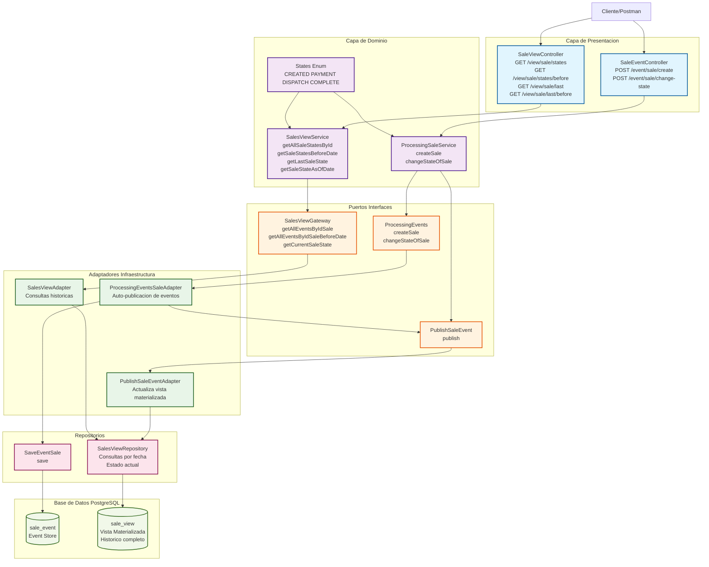

# Event Sourcing POC - Universidad de La Sabana

Repositorio de ejemplo con implementación del patrón de persistencia de datos **Event Sourcing** para el sistema de gestión de ventas.

## 📋 Tabla de Contenidos

- [Descripción](#descripción)
- [Arquitectura](#arquitectura)
- [Diagrama de Clases](#diagrama-de-clases)
- [Tecnologías](#tecnologías)
- [Requisitos Previos](#requisitos-previos)
- [Instalación y Configuración](#instalación-y-configuración)
- [Uso de la API](#uso-de-la-api)
- [Estructura del Proyecto](#estructura-del-proyecto)
- [Patrón Event Sourcing](#patrón-event-sourcing)

## 📖 Descripción

Este proyecto es una **Prueba de Concepto (POC)** que demuestra la implementación del patrón de arquitectura **Event Sourcing** aplicado a un sistema de gestión de ventas. 

En lugar de almacenar únicamente el estado actual de una venta, el sistema registra **todos los eventos** que han ocurrido a lo largo de su ciclo de vida, permitiendo:

- ✅ **Auditoría completa**: Histórico inmutable de todos los cambios
- ✅ **Reconstrucción del estado**: Posibilidad de recrear el estado en cualquier punto en el tiempo
- ✅ **Vistas materializadas**: Consultas optimizadas mediante proyecciones
- ✅ **Trazabilidad**: Seguimiento completo del flujo de estados

## 🏗️ Arquitectura

El sistema implementa una arquitectura hexagonal (puertos y adaptadores) con separación clara de responsabilidades:



### Capas del Sistema

```
┌─────────────────────────────────────────────────────────┐
│              CAPA DE PRESENTACIÓN                       │
│  (Controllers - REST API)                               │
│  • SaleEventController - Comandos                       │
│  • SaleViewController - Consultas                       │
└─────────────────────────────────────────────────────────┘
                         ↓
┌─────────────────────────────────────────────────────────┐
│              CAPA DE DOMINIO                            │
│  (Services - Lógica de Negocio)                         │
│  • ProcessingSaleService                                │
│  • SalesViewService                                     │
└─────────────────────────────────────────────────────────┘
                         ↓
┌─────────────────────────────────────────────────────────┐
│              CAPA DE GATEWAY                            │
│  (Interfaces - Puertos)                                 │
│  • ProcessingEvents                                     │
│  • PublishSaleEvent, SalesViewGateway                   │
└─────────────────────────────────────────────────────────┘
                         ↓
┌─────────────────────────────────────────────────────────┐
│              CAPA DE ADAPTADORES                        │
│  (Implementaciones - Adaptadores)                       │
│  • event/                                               │
│    • ProcessingEventsSaleAdapter - Almacena eventos y los publica.
│  • publish/                                             │
│    • PublishSaleEventAdapter - Actualiza la vista materializada.
│  • view/                                                │
│    • SalesViewAdapter - Consulta el historial de ventas.
└─────────────────────────────────────────────────────────┘
                         ↓
┌─────────────────────────────────────────────────────────┐
│              CAPA DE PERSISTENCIA                       │
│  (Repositories - JPA)                                   │
│  • event/SaveEventSale                                  │
│  • view/SalesViewRepository                             │
└─────────────────────────────────────────────────────────┘
                         ↓
┌─────────────────────────────────────────────────────────┐
│              BASE DE DATOS                              │
│  PostgreSQL                                             │
│  • Tabla: sale_event (Event Store)                     │
│  • Tabla: sale_view (Vista Materializada)              │
└─────────────────────────────────────────────────────────┘
```

### Flujos Principales

#### 1. Creación de una Venta
```
POST /event/sale/create → SaleEventController.createSale()
→ ProcessingSaleService.createSale()
→ ProcessingEvents.createSale()
→ ProcessingEventsSaleAdapter.createSale()
→ SaveEventSale.save() → DB (sale_event)
→ PublishSaleEvent.publish() → PublishSaleEventAdapter.publish()
→ SalesViewRepository.save() → DB (sale_view)
```

#### 2. Procesamiento de Estados de Venta
```
# Pago de Venta
POST /event/sale/payment?sale_id={id} → SaleEventController.paymentSale()
→ ProcessingSaleService.saveSaleState(saleId, PAYMENT)
[Flujo similar al de creación con el estado correspondiente]

# Despacho de Venta
POST /event/sale/dispatch?sale_id={id} → SaleEventController.dispatchSale()
→ ProcessingSaleService.saveSaleState(saleId, DISPATCH)
[Flujo similar al de creación con el estado correspondiente]

# Completar Venta
POST /event/sale/complete?sale_id={id} → SaleEventController.completeSale()
→ ProcessingSaleService.saveSaleState(saleId, COMPLETE)
[Flujo similar al de creación con el estado correspondiente]
```

#### 3. Consulta de Vistas
```
# Obtener todos los estados de una venta
GET /view/sale/states → SaleViewController
→ SalesViewService.getAllSaleStatesById()
→ SalesViewGateway.getAllSaleStatesById()
→ SalesViewAdapter.getAllSaleStatesById()
→ SalesViewRepository.findAllByIdSaleOrderByCreationDate()

# Obtener estados de venta antes de una fecha
GET /view/sale/states/before → SaleViewController
[Flujo similar al anterior con filtro de fecha]

# Obtener último estado de venta
GET /view/sale/last → SaleViewController
[Flujo similar al anterior]

# Obtener estado de venta en una fecha específica
GET /view/sale/last/before → SaleViewController
[Flujo similar al anterior]
```

## 📊 Diagrama de Clases

```mermaid
classDiagram
    %% Enumeraciones
    class States {
        <<enumeration>>
        CREATED
        PAYMENT
        DISPATCH
        COMPLETE
        -String previousState
        -String nextState
        +fromString(String text) States
        +getPreviousState() String
        +getNextState() String
    }

    %% Entidades de Dominio
    class SaleEventEntity {
        -Long saleId
        -States status
        -Instant lastEventDate
        +SaleEventEntity(Long saleId, States status)
        +SaleEventEntity(Long saleId, States status, Instant lastEventDate)
    }

    class SaleViewEntity {
        -Long saleId
        -States status
        -Instant createdAt
        -Instant updatedAt
        +SaleViewEntity(Long saleId, States status, Instant createdAt, Instant updatedAt)
    }

    %% Modelos de Persistencia
    class SaleEvent {
        <<Entity>>
        -Long id
        -Long saleId
        -States status
        -Instant lastEventDate
        +getId() Long
        +getSaleId() Long
        +getStatus() States
        +getLastEventDate() Instant
    }

    class SaleView {
        <<Entity>>
        -Long saleId
        -States status
        -Instant createdAt
        -Instant lastUpdatedAt
        +getSaleId() Long
        +getStatus() States
        +getCreatedAt() Instant
        +getLastUpdatedAt() Instant
    }

    %% Controladores
    class SaleEventController {
        <<RestController>>
        -ProcessingSaleService processingSaleService
        +createSale() ResponseEntity~Long~
        +paymentSale(Long saleId) ResponseEntity~String~
        +dispatchSale(Long saleId) ResponseEntity~String~
        +completeSale(Long saleId) ResponseEntity~String~
    }

    class SaleViewController {
        <<RestController>>
        -SalesViewService salesViewService
        +getAllSaleStatesById(Long id) ResponseEntity~List~SaleEventEntity~~
        +getSaleStatesBeforeDate(Long id, Instant date) ResponseEntity~List~SaleEventEntity~~
        +getLastSaleState(Long id) ResponseEntity~SaleEventEntity~
        +getSaleStateAsOfDate(Long id, Instant date) ResponseEntity~SaleViewEntity~
    }

    %% Servicios de Dominio
    class ProcessingSaleService {
        <<Service>>
        -ProcessingEvents processingEvents
        -SalesViewService salesViewService
        +createSale() Long
        +saveSaleState(Long saleId, States status) void
    }

    class SalesViewService {
        <<Service>>
        -SalesViewGateway salesViewGateway
        +getAllSaleStatesById(Long id) List~SaleEventEntity~
        +getSaleStatesBeforeDate(Long id, Instant date) List~SaleEventEntity~
        +getLastSaleState(Long id) SaleEventEntity
        +getSaleStateAsOfDate(Long id, Instant date) SaleViewEntity
    }

    %% Gateways (Interfaces)
    class ProcessingEvents {
        <<interface>>
        +createSale(SaleEventEntity sale) void
        +changeStateOfSale(SaleEventEntity sale) void
    }

    class SalesViewGateway {
        <<interface>>
        +getAllSaleStatesById(Long id) List~SaleEventEntity~
        +getSaleStatesBeforeDate(Long id, Instant date) List~SaleEventEntity~
        +getLastSaleState(Long id) SaleEventEntity
        +getSaleStateAsOfDate(Long id, Instant date) SaleViewEntity
    }

    %% Adaptadores
    class ProcessingEventsSaleAdapter {
        <<Component>>
        -SaveEventSale saveEventSale
        -PublishSaleEvent publishSaleEvent
        +createSale(SaleEventEntity sale) void
        +changeStateOfSale(SaleEventEntity sale) void
    }

    class SalesViewAdapter {
        <<Component>>
        -SalesViewRepository salesViewRepository
        +getAllSaleStatesById(Long id) List~SaleEventEntity~
        +getSaleStatesBeforeDate(Long id, Instant date) List~SaleEventEntity~
        +getLastSaleState(Long id) SaleEventEntity
        +getSaleStateAsOfDate(Long id, Instant date) SaleViewEntity
    }

    %% Repositorios
    class SaveEventSale {
        <<interface>>
        <<JpaRepository>>
        +save(SaleEvent sale) SaleEvent
        +findByIdSaleOrderByLastEventDateDesc(Long saleId) List~SaleEvent~
        +findByIdSaleAndLastEventDateBeforeOrderByLastEventDateDesc(Long saleId, Instant date) List~SaleEvent~
    }

    class SalesViewRepository {
        <<interface>>
        <<JpaRepository>>
        +findBySaleIdOrderByCreatedAtDesc(Long saleId) List~SaleView~
        +findBySaleIdAndCreatedAtBeforeOrderByCreatedAtDesc(Long saleId, Instant date) List~SaleView~
        +findFirstBySaleIdOrderByCreatedAtDesc(Long saleId) Optional~SaleView~
    }

    %% Relaciones - Controllers
    SaleEventController --> ProcessingSaleService : usa
    SaleViewController --> SalesViewService : usa

    %% Relaciones - Services
    ProcessingSaleService --> ProcessingEvents : usa
    ProcessingSaleService --> SalesViewService : usa
    SalesViewService --> SalesViewGateway : usa

    %% Relaciones - Adapters implementan Gateways
    ProcessingEventsSaleAdapter ..|> ProcessingEvents : implementa
    SalesViewAdapter ..|> SalesViewGateway : implementa

    %% Relaciones - Adapters usan Repositories
    ProcessingEventsSaleAdapter --> SaveEventSale : usa
    SalesViewAdapter --> SalesViewRepository : usa

    %% Relaciones - Entidades
    SaleEventEntity --> States : tiene
    SaleViewEntity --> States : tiene
```



### Máquina de Estados

La siguiente secuencia muestra el ciclo de vida de una venta:

```
CREATED → PAYMENT → DISPATCH → COMPLETE
```

Cada estado conoce su estado anterior y siguiente, permitiendo validaciones automáticas.

#### Separación de Responsabilidades

**Event Store (SaleEvent)**  
- Almacena TODOS los eventos de cambio de estado  
- Registro inmutable y auditado  
- Base para reconstruir el histórico  

**Vista Materializada (SaleView)**  
- Proyección optimizada para consultas  
- Solo contiene el estado actual  
- Actualizada automáticamente al publicar eventos

## 🛠️ Tecnologías

- **Java 21** - Lenguaje de programación
- **Spring Boot 3.5.6** - Framework principal
- **Spring Data JPA** - Persistencia de datos
- **PostgreSQL 17.2** - Base de datos relacional
- **Lombok** - Reducción de código boilerplate
- **Gradle** - Gestión de dependencias y construcción
- **Docker Compose** - Contenerización de servicios

## 📋 Requisitos Previos

- Java 21 o superior
- Docker y Docker Compose
- Gradle (incluido wrapper en el proyecto)
- Git

## 🚀 Instalación y Configuración

### 1. Clonar el Repositorio

```bash
git clone https://github.com/tu-usuario/usabana-event-sourcing.git
cd usabana-event-sourcing
```

### 2. Iniciar Base de Datos con Docker

```bash
docker-compose up -d
```

Esto iniciará un contenedor PostgreSQL con:
- **Base de datos**: `ventas_db`
- **Usuario**: `admin`
- **Contraseña**: `admin`
- **Puerto**: `5432`

### 3. Verificar la Base de Datos

```bash
docker ps
```

### 4. Compilar el Proyecto

**Windows:**
```cmd
gradlew.bat clean build
```

**Linux/Mac:**
```bash
./gradlew clean build
```

### 5. Ejecutar la Aplicación

**Windows:**
```cmd
gradlew.bat bootRun
```

**Linux/Mac:**
```bash
./gradlew bootRun
```

La aplicación estará disponible en: `http://localhost:8080`

## 📡 Uso de la API

### API de Comandos (Escritura de Eventos)

#### 1. Crear una Nueva Venta
```http
POST http://localhost:8080/event/sale/create
```

**Respuesta Exitosa:**
```json
1234567890
```

**Descripción:** Crea una nueva venta con estado `CREATED` y devuelve el ID de la venta.

#### 2. Registrar Pago de una Venta
```http
POST http://localhost:8080/event/sale/payment?sale_id=1234567890
```

**Respuesta Exitosa:**
```json
"successful payment"
```

**Respuesta de Error:**
```json
"SaleEntity with id 1234567890 has complete"
```

**Descripción:** Actualiza el estado de la venta a `PAYMENT`. La venta debe estar en estado `CREATED`.

#### 3. Despachar una Venta
```http
POST http://localhost:8080/event/sale/dispatch?sale_id=1234567890
```

**Respuesta Exitosa:**
```json
"successful dispatch"
```

**Descripción:** Actualiza el estado de la venta a `DISPATCH`. La venta debe estar en estado `PAYMENT`.

#### 4. Completar una Venta
```http
POST http://localhost:8080/event/sale/complete?sale_id=1234567890
```

**Respuesta Exitosa:**
```json
"successful complete"
```

**Descripción:** Actualiza el estado de la venta a `COMPLETE`. La venta debe estar en estado `DISPATCH`.

### API de Consultas (Lectura de Vistas)

#### 1. Obtener todos los estados de una venta
```http
GET http://localhost:8080/view/sale/1234567890/states
```

**Respuesta Exitosa:**
```json
[
  {
    "saleId": 1234567890,
    "status": "CREATED",
    "lastEventDate": "2025-10-09T15:45:00Z"
  },
  {
    "saleId": 1234567890,
    "status": "PAYMENT",
    "lastEventDate": "2025-10-09T15:46:30Z"
  }
]
```

#### 2. Obtener estados de venta antes de una fecha
```http
GET http://localhost:8080/view/sale/1234567890/states/before?date=2025-10-09T16:00:00Z
```

**Respuesta Exitosa:** Similar a la respuesta anterior, pero solo incluye eventos antes de la fecha especificada.

#### 3. Obtener último estado de una venta
```http
GET http://localhost:8080/view/sale/1234567890/last
```

**Respuesta Exitosa:**
```json
{
  "saleId": 1234567890,
  "status": "PAYMENT",
  "lastEventDate": "2025-10-09T15:46:30Z"
}
```

#### 4. Obtener estado de venta en una fecha específica
```http
GET http://localhost:8080/view/sale/1234567890/last/before?date=2025-10-09T16:00:00Z
```

**Respuesta Exitosa:**
```json
{
  "saleId": 1234567890,
  "status": "PAYMENT",
  "createdAt": "2025-10-09T15:46:30Z"
}
```

**Nota:** Los siguientes endpoints mostrados anteriormente en la documentación no están implementados actualmente en la aplicación:
- `GET /api/sales-view`
- `GET /api/sales-view/by-status?status={status}`
- `GET /api/sales-view/{id}`

### Códigos de Estado HTTP

- `200 OK`: La solicitud se completó exitosamente.
- `400 Bad Request`: Error en la solicitud (ej: estado de venta inválido).
- `404 Not Found`: La venta especificada no existe.
- `500 Internal Server Error`: Error del servidor al procesar la solicitud.

### Notas Importantes

1. Los IDs de venta son números largos generados automáticamente.
2. Las fechas deben estar en formato ISO-8601 (ej: `2025-10-09T15:00:00Z`).
3. Las transiciones de estado deben seguir el orden definido: `CREATED` → `PAYMENT` → `DISPATCH` → `COMPLETE`.
4. No se pueden omitir estados en el flujo de la venta.

**Respuesta:**
```json
[
  {
    "saleId": 1,
    "status": "CREATED",
    "lastEventDate": "2025-10-06T18:00:00Z"
  },
  {
    "saleId": 1,
    "status": "PAYMENT",
    "lastEventDate": "2025-10-06T18:30:00Z"
  }
]
```

## 📁 Estructura del Proyecto

```
usabana-event-sourcing/
├── src/main/java/com/sabana/event_sourcing_poc/
│   ├── EventSourcingPocApplication.java       # Clase principal
│   ├── controller/                            # Capa de presentación
│   │   ├── SaleEventController.java          # API de comandos
│   │   └── SaleViewController.java           # API de consultas
│   ├── domain/                                # Servicios de dominio
│   │   ├── ProcessingSaleService.java        # Lógica de eventos
│   │   └── SalesViewService.java             # Lógica de vistas
│   ├── entity/                                # Entidades de dominio
│   │   ├── SaleEventEntity.java              # Entidad de evento
│   │   ├── SaleViewEntity.java               # Entidad de vista
│   │   ├── SaleEvent.java                    # Modelo JPA (eventos)
│   │   ├── SaleView.java                     # Modelo JPA (vista)
│   │   └── States.java                       # Enum de estados
│   ├── gateway/                               # Puertos (interfaces)
│   │   ├── ProcessingEvents.java
│   │   ├── PublishSaleEvent.java
│   │   └── SalesViewGateway.java
│   ├── adapter/                               # Adaptadores
│   │   ├── event/
│   │   │   └── ProcessingEventsSaleAdapter.java
│   │   ├── publish/
│   │   │   └── PublishSaleEventAdapter.java
│   │   └── view/
│   │       └── SalesViewAdapter.java
│   └── repository/                            # Repositorios JPA
│       ├── event/
│       │   ├── model/
│       │   │   └── SaleEvent.java
│       │   └── SaveEventSale.java
│       └── view/
│           ├── model/
│           │   └── SaleView.java
│           └── SalesViewRepository.java
├── src/main/resources/
│   └── application.properties                # Configuración
├── sql/init/scripts/
│   └── init.sql                              # Scripts de inicialización
├── docker-compose.yml                        # Configuración Docker
├── build.gradle                              # Configuración Gradle
└── README.md                                 # Este archivo
```

## 🔄 Patrón Event Sourcing

### ¿Qué es Event Sourcing?

Event Sourcing es un patrón arquitectónico donde los cambios de estado se almacenan como una secuencia de eventos en lugar de sobrescribir el estado actual.

### Ventajas en este Proyecto

1. **Auditoría Completa**: Cada cambio de estado queda registrado permanentemente
2. **Viaje en el Tiempo**: Consultar el histórico de cualquier venta en cualquier momento
3. **Debugging Mejorado**: Rastrear exactamente qué pasó y cuándo
4. **Event Replay**: Reconstruir el estado actual desde cero reproduciendo eventos
5. **Proyecciones Múltiples**: Crear diferentes vistas optimizadas para diferentes casos de uso

### CQRS (Command Query Responsibility Segregation)

El proyecto implementa CQRS separando:

- **Command Side**: Escritura de eventos (`SaleEventController`, `SaleEvent`)
- **Query Side**: Lectura de vistas (`SaleViewController`, `SaleView`)

Esta separación permite:
- Optimizar las consultas independientemente de las escrituras
- Escalar lectura y escritura de forma independiente
- Mantener modelos especializados para cada operación

## 🔄 Nota sobre la Implementación Actual

Esta implementación inicial de la POC se centra en la estructura base del patrón Event Sourcing, manteniendo tanto la escritura de comandos como la lectura
de consultas en un mismo módulo por simplicidad. Cabe destacar que la publicación de eventos se encuentra en una fase emulada, sin un sistema de mensajería externo.

## 👥 Autores

**Universidad de La Sabana** - Diplomado en Arquitectura de Software

- Alexy Yesenia Rincón Capera
- Karen Ximena Orozco Gamboa
- Harver Andrey Cordero Duarte
- Juan Sebastian Joya Rodriguez
