# Event Sourcing POC - Universidad de La Sabana

Repositorio de ejemplo con implementación del patrón de persistencia de datos **Event Sourcing** para el sistema de gestión de ventas.

## 📋 Tabla de Contenidos

- [Descripción](#descripción)
- [Arquitectura](#arquitectura)
- [Diagrama de Clases](#diagrama-de-clases)
- [Tecnologías](#tecnologías)
- [Requisitos Previos](#requisitos-previos)
- [Instalación y Configuración](#instalación-y-configuración)
- [Uso de la API](#uso-de-la-api)
- [Estructura del Proyecto](#estructura-del-proyecto)
- [Patrón Event Sourcing](#patrón-event-sourcing)

## 📖 Descripción

Este proyecto es una **Prueba de Concepto (POC)** que demuestra la implementación del patrón de arquitectura **Event Sourcing** aplicado a un sistema de gestión de ventas. 

En lugar de almacenar únicamente el estado actual de una venta, el sistema registra **todos los eventos** que han ocurrido a lo largo de su ciclo de vida, permitiendo:

- ✅ **Auditoría completa**: Histórico inmutable de todos los cambios
- ✅ **Reconstrucción del estado**: Posibilidad de recrear el estado en cualquier punto en el tiempo
- ✅ **Vistas materializadas**: Consultas optimizadas mediante proyecciones
- ✅ **Trazabilidad**: Seguimiento completo del flujo de estados

## 🏗️ Arquitectura

El sistema implementa una arquitectura hexagonal (puertos y adaptadores) con separación clara de responsabilidades:

### Capas del Sistema

```
┌─────────────────────────────────────────────────────────┐
│              CAPA DE PRESENTACIÓN                       │
│  (Controllers - REST API)                               │
│  • SaleEventController - Comandos                       │
│  • SaleViewController - Consultas                       │
└─────────────────────────────────────────────────────────┘
                         ↓
┌─────────────────────────────────────────────────────────┐
│              CAPA DE DOMINIO                            │
│  (Services - Lógica de Negocio)                         │
│  • ProcessingSaleService                                │
│  • SalesViewService                                     │
└─────────────────────────────────────────────────────────┘
                         ↓
┌─────────────────────────────────────────────────────────┐
│              CAPA DE GATEWAY                            │
│  (Interfaces - Puertos)                                 │
│  • ProcessingEvents, ReadSaleEvents                     │
│  • PublishSaleEvent, SalesViewGateway                   │
└─────────────────────────────────────────────────────────┘
                         ↓
┌─────────────────────────────────────────────────────────┐
│              CAPA DE ADAPTADORES                        │
│  (Implementaciones - Adaptadores)                       │
│  • ProcessingEventsSaleAdapter                          │
│  • ReadEventSaleAdapter                                 │
│  • PublishSaleEventAdapter                              │
│  • SalesViewAdapter                                     │
└─────────────────────────────────────────────────────────┘
                         ↓
┌─────────────────────────────────────────────────────────┐
│              CAPA DE PERSISTENCIA                       │
│  (Repositories - JPA)                                   │
│  • SaveEventSale, ReadEventSale                         │
│  • SalesRepository                                      │
└─────────────────────────────────────────────────────────┘
                         ↓
┌─────────────────────────────────────────────────────────┐
│              BASE DE DATOS                              │
│  PostgreSQL                                             │
│  • Tabla: sale_event (Event Store)                     │
│  • Tabla: sale_view (Vista Materializada)              │
└─────────────────────────────────────────────────────────┘
```

### Flujos Principales

#### 1. Escritura de Eventos (Command Side)
```
POST /api/sales → SaleEventController → ProcessingSaleService 
→ ProcessingEvents → ProcessingEventsSaleAdapter 
→ SaveEventSale → DB (sale_event)
→ PublishSaleEvent → SalesRepository → DB (sale_view)
```

#### 2. Lectura de Vistas (Query Side)
```
GET /api/sales-view → SaleViewController → SalesViewService 
→ SalesViewGateway → SalesViewAdapter 
→ SalesRepository → DB (sale_view)
```

#### 3. Consulta de Histórico
```
GET /api/sales/{id}/history → SaleEventController 
→ ProcessingSaleService → ReadSaleEvents 
→ ReadEventSaleAdapter → ReadEventSale → DB (sale_event)
```

## 📊 Diagrama de Clases

```mermaid
classDiagram
    %% Enumeraciones
    class States {
        <<enumeration>>
        CREATED
        PAYMENT
        DISPATCH
        COMPLETE
        -String previousState
        -String nextState
        +fromString(String text) States
        +getPreviousState() String
        +getNextState() String
    }

    %% Entidades de Dominio
    class SaleEventEntity {
        -Long saleId
        -States status
        -Instant lastEventDate
        +SaleEventEntity(Long saleId, States status)
        +SaleEventEntity(Long saleId, States status, Instant lastEventDate)
    }

    class SaleViewEntity {
        -Long saleId
        -States status
        -Instant createdAt
        -Instant updatedAt
        +SaleViewEntity(Long saleId, States status, Instant createdAt, Instant updatedAt)
    }

    %% Modelos de Persistencia
    class SaleEvent {
        <<Entity>>
        -Long id
        -Long saleId
        -States status
        -Instant lastEventDate
        +getId() Long
        +getSaleId() Long
        +getStatus() States
        +getLastEventDate() Instant
    }

    class SaleView {
        <<Entity>>
        -Long saleId
        -States status
        -Instant createdAt
        -Instant lastUpdatedAt
        +getSaleId() Long
        +getStatus() States
        +getCreatedAt() Instant
        +getLastUpdatedAt() Instant
    }

    %% Controladores
    class SaleEventController {
        <<RestController>>
        -ProcessingSaleService processingSaleService
        +createSale() ResponseEntity~Long~
        +paymentSale(Long saleId) ResponseEntity~String~
        +dispatchSale(Long saleId) ResponseEntity~String~
        +completeSale(Long saleId) ResponseEntity~String~
        +getSaleState(Long saleId) ResponseEntity~SaleEventEntity~
        +getSaleHistory(Long saleId, Instant date) ResponseEntity~List~SaleEventEntity~~
    }

    class SaleViewController {
        <<RestController>>
        -SalesViewService salesViewService
        +getAllSales() ResponseEntity~List~SaleViewEntity~~
        +getSalesByStatus(States status) ResponseEntity~List~SaleViewEntity~~
        +getSaleById(Long id) ResponseEntity~SaleViewEntity~
    }

    %% Servicios de Dominio
    class ProcessingSaleService {
        <<Service>>
        -ProcessingEvents processingEvents
        -ReadSaleEvents readSaleEvents
        +createSale() Long
        +saveSaleState(Long saleId, States status) void
        +getSaleStatesBeforeDate(Long saleId, Instant date) List~SaleEventEntity~
        +getLastSaleState(Long saleId) SaleEventEntity
    }

    class SalesViewService {
        <<Service>>
        -SalesViewGateway salesViewGateway
        +getSalesByStatus(States status) List~SaleViewEntity~
        +getAllSales() List~SaleViewEntity~
        +getSaleById(Long id) SaleViewEntity
    }

    %% Gateways (Interfaces)
    class ProcessingEvents {
        <<interface>>
        +createSale(SaleEventEntity sale) void
        +changeStateOfSale(SaleEventEntity sale) void
    }

    class ReadSaleEvents {
        <<interface>>
        +getSaleStatesBeforeDate(Long saleId, Instant date) List~SaleEventEntity~
        +getLastStateOfSale(Long saleId) Optional~SaleEventEntity~
    }

    class PublishSaleEvent {
        <<interface>>
        +publish(SaleEvent saleEvent) void
    }

    class SalesViewGateway {
        <<interface>>
        +getAllSales() List~SaleViewEntity~
        +getSaleById(Long id) Optional~SaleViewEntity~
        +getSalesByStatus(States status) List~SaleViewEntity~
    }

    %% Adaptadores
    class ProcessingEventsSaleAdapter {
        <<Component>>
        -SaveEventSale saveEventSale
        -PublishSaleEvent publishSaleEvent
        +createSale(SaleEventEntity saleEventEntity) void
        +changeStateOfSale(SaleEventEntity saleEventEntity) void
    }

    class ReadEventSaleAdapter {
        <<Component>>
        -ReadEventSale readEventSale
        +getSaleStatesBeforeDate(Long saleId, Instant date) List~SaleEventEntity~
        +getLastStateOfSale(Long saleId) Optional~SaleEventEntity~
    }

    class PublishSaleEventAdapter {
        <<Component>>
        -SalesRepository salesRepository
        +publish(SaleEvent sale) void
    }

    class SalesViewAdapter {
        <<Component>>
        -SalesRepository salesRepository
        +getAllSales() List~SaleViewEntity~
        +getSaleById(Long id) Optional~SaleViewEntity~
        +getSalesByStatus(States status) List~SaleViewEntity~
    }

    %% Repositorios JPA
    class SaveEventSale {
        <<interface>>
        <<JpaRepository>>
        +save(SaleEvent saleEvent) SaleEvent
    }

    class ReadEventSale {
        <<interface>>
        <<JpaRepository>>
        +findAllBySaleIdAndLastEventDateBefore(Long saleId, Instant date) List~SaleEvent~
        +findFirstBySaleIdOrderByLastEventDateDesc(Long saleId) SaleEvent
    }

    class SalesRepository {
        <<interface>>
        <<JpaRepository>>
        +findAll() List~SaleView~
        +findById(Long id) Optional~SaleView~
        +findByStatus(States status) List~SaleView~
        +save(SaleView saleView) SaleView
        +updateSale(States status, Instant lastUpdatedAt, Long saleId) void
    }

    %% Relaciones - Controllers
    SaleEventController --> ProcessingSaleService : usa
    SaleViewController --> SalesViewService : usa

    %% Relaciones - Services
    ProcessingSaleService --> ProcessingEvents : usa
    ProcessingSaleService --> ReadSaleEvents : usa
    SalesViewService --> SalesViewGateway : usa

    %% Relaciones - Adapters implementan Gateways
    ProcessingEventsSaleAdapter ..|> ProcessingEvents : implementa
    ReadEventSaleAdapter ..|> ReadSaleEvents : implementa
    PublishSaleEventAdapter ..|> PublishSaleEvent : implementa
    SalesViewAdapter ..|> SalesViewGateway : implementa

    %% Relaciones - Adapters usan Repositories
    ProcessingEventsSaleAdapter --> SaveEventSale : usa
    ProcessingEventsSaleAdapter --> PublishSaleEvent : usa
    ReadEventSaleAdapter --> ReadEventSale : usa
    PublishSaleEventAdapter --> SalesRepository : usa
    SalesViewAdapter --> SalesRepository : usa

    %% Relaciones - Repositories con Entities
    SaveEventSale --> SaleEvent : persiste
    ReadEventSale --> SaleEvent : consulta
    SalesRepository --> SaleView : gestiona

    %% Relaciones - Entities con Estados
    SaleEventEntity --> States : tiene
    SaleViewEntity --> States : tiene
    SaleEvent --> States : tiene
    SaleView --> States : tiene

    %% Relaciones - Servicios con Entities
    ProcessingSaleService ..> SaleEventEntity : crea/retorna
    SalesViewService ..> SaleViewEntity : retorna
```



### Descripción de Componentes

#### Estados de Venta (States)
Máquina de estados que define el ciclo de vida de una venta:
- **CREATED** → **PAYMENT** → **DISPATCH** → **COMPLETE**

Cada estado conoce su estado anterior y siguiente, permitiendo validaciones automáticas.

#### Separación de Responsabilidades

**Event Store (SaleEvent)**
- Almacena TODOS los eventos de cambio de estado
- Registro inmutable y auditado
- Base para reconstruir el histórico

**Vista Materializada (SaleView)**
- Proyección optimizada para consultas
- Solo contiene el estado actual
- Actualizada automáticamente al publicar eventos

## 🛠️ Tecnologías

- **Java 21** - Lenguaje de programación
- **Spring Boot 3.5.6** - Framework principal
- **Spring Data JPA** - Persistencia de datos
- **PostgreSQL 17.2** - Base de datos relacional
- **Lombok** - Reducción de código boilerplate
- **Gradle** - Gestión de dependencias y construcción
- **Docker Compose** - Contenerización de servicios

## 📋 Requisitos Previos

- Java 21 o superior
- Docker y Docker Compose
- Gradle (incluido wrapper en el proyecto)
- Git

## 🚀 Instalación y Configuración

### 1. Clonar el Repositorio

```bash
git clone https://github.com/tu-usuario/usabana-event-sourcing.git
cd usabana-event-sourcing
```

### 2. Iniciar Base de Datos con Docker

```bash
docker-compose up -d
```

Esto iniciará un contenedor PostgreSQL con:
- **Base de datos**: `ventas_db`
- **Usuario**: `admin`
- **Contraseña**: `admin`
- **Puerto**: `5432`

### 3. Verificar la Base de Datos

```bash
docker ps
```

### 4. Compilar el Proyecto

**Windows:**
```cmd
gradlew.bat clean build
```

**Linux/Mac:**
```bash
./gradlew clean build
```

### 5. Ejecutar la Aplicación

**Windows:**
```cmd
gradlew.bat bootRun
```

**Linux/Mac:**
```bash
./gradlew bootRun
```

La aplicación estará disponible en: `http://localhost:8080`

## 📡 Uso de la API

### API de Comandos (Escritura de Eventos)

#### Crear una Nueva Venta
```http
POST http://localhost:8080/api/sales
```

**Respuesta:**
```json
1
```

#### Registrar Pago de una Venta
```http
POST http://localhost:8080/api/sales/1/payment
```

**Respuesta:**
```json
"Sale payment successfully"
```

#### Despachar una Venta
```http
POST http://localhost:8080/api/sales/1/dispatch
```

**Respuesta:**
```json
"Sale dispatch successfully"
```

#### Completar una Venta
```http
POST http://localhost:8080/api/sales/1/complete
```

**Respuesta:**
```json
"Sale complete successfully"
```

#### Consultar Estado Actual de una Venta
```http
GET http://localhost:8080/api/sales/1
```

**Respuesta:**
```json
{
  "saleId": 1,
  "status": "PAYMENT",
  "lastEventDate": "2025-10-06T18:30:00Z"
}
```

#### Consultar Histórico de una Venta
```http
GET http://localhost:8080/api/sales/1/history?date=2025-10-06T20:00:00Z
```

**Respuesta:**
```json
[
  {
    "saleId": 1,
    "status": "CREATED",
    "lastEventDate": "2025-10-06T18:00:00Z"
  },
  {
    "saleId": 1,
    "status": "PAYMENT",
    "lastEventDate": "2025-10-06T18:30:00Z"
  }
]
```

### API de Consultas (Lectura de Vistas)

#### Obtener Todas las Ventas
```http
GET http://localhost:8080/api/sales-view
```

**Respuesta:**
```json
[
  {
    "saleId": 1,
    "status": "PAYMENT",
    "createdAt": "2025-10-06T18:00:00Z",
    "updatedAt": "2025-10-06T18:30:00Z"
  },
  {
    "saleId": 2,
    "status": "COMPLETE",
    "createdAt": "2025-10-05T10:00:00Z",
    "updatedAt": "2025-10-05T15:00:00Z"
  }
]
```

#### Filtrar Ventas por Estado
```http
GET http://localhost:8080/api/sales-view/by-status?status=PAYMENT
```

**Respuesta:**
```json
[
  {
    "saleId": 1,
    "status": "PAYMENT",
    "createdAt": "2025-10-06T18:00:00Z",
    "updatedAt": "2025-10-06T18:30:00Z"
  }
]
```

#### Obtener una Venta por ID
```http
GET http://localhost:8080/api/sales-view/1
```

**Respuesta:**
```json
{
  "saleId": 1,
  "status": "PAYMENT",
  "createdAt": "2025-10-06T18:00:00Z",
  "updatedAt": "2025-10-06T18:30:00Z"
}
```

## 📁 Estructura del Proyecto

```
usabana-event-sourcing/
├── src/main/java/com/sabana/event_sourcing_poc/
│   ├── EventSourcingPocApplication.java       # Clase principal
│   ├── controller/                            # Capa de presentación
│   │   ├── SaleEventController.java          # API de comandos
│   │   └── SaleViewController.java           # API de consultas
│   ├── domain/                                # Servicios de dominio
│   │   ├── ProcessingSaleService.java        # Lógica de eventos
│   │   └── SalesViewService.java             # Lógica de vistas
│   ├── entity/                                # Entidades de dominio
│   │   ├── SaleEventEntity.java              # Entidad de evento
│   │   ├── SaleViewEntity.java               # Entidad de vista
│   │   ├── SaleEvent.java                    # Modelo JPA (eventos)
│   │   ├── SaleView.java                     # Modelo JPA (vista)
│   │   └── States.java                       # Enum de estados
│   ├── gateway/                               # Puertos (interfaces)
│   │   ├── ProcessingEvents.java
│   │   ├── ReadSaleEvents.java
│   │   ├── PublishSaleEvent.java
│   │   └── SalesViewGateway.java
│   ├── adapter/                               # Adaptadores
│   │   ├── event/
│   │   │   ├── ProcessingEventsSaleAdapter.java
│   │   │   └── ReadEventSaleAdapter.java
│   │   ├── publish/
│   │   │   └── PublishSaleEventAdapter.java
│   │   └── view/
│   │       └── SalesViewAdapter.java
│   └── repository/                            # Repositorios JPA
│       ├── SaveEventSale.java
│       ├── ReadEventSale.java
│       └── SalesRepository.java
├── src/main/resources/
│   └── application.properties                # Configuración
├── sql/init/scripts/
│   └── init.sql                              # Scripts de inicialización
├── docker-compose.yml                        # Configuración Docker
├── build.gradle                              # Configuración Gradle
└── README.md                                 # Este archivo
```

## 🔄 Patrón Event Sourcing

### ¿Qué es Event Sourcing?

Event Sourcing es un patrón arquitectónico donde los cambios de estado se almacenan como una secuencia de eventos en lugar de sobrescribir el estado actual.

### Ventajas en este Proyecto

1. **Auditoría Completa**: Cada cambio de estado queda registrado permanentemente
2. **Viaje en el Tiempo**: Consultar el histórico de cualquier venta en cualquier momento
3. **Debugging Mejorado**: Rastrear exactamente qué pasó y cuándo
4. **Event Replay**: Reconstruir el estado actual desde cero reproduciendo eventos
5. **Proyecciones Múltiples**: Crear diferentes vistas optimizadas para diferentes casos de uso

### CQRS (Command Query Responsibility Segregation)

El proyecto implementa CQRS separando:

- **Command Side**: Escritura de eventos (`SaleEventController`, `SaleEvent`)
- **Query Side**: Lectura de vistas (`SaleViewController`, `SaleView`)

Esta separación permite:
- Optimizar las consultas independientemente de las escrituras
- Escalar lectura y escritura de forma independiente
- Mantener modelos especializados para cada operación

## 🤝 Contribuir

1. Fork el proyecto
2. Crea una rama para tu feature (`git checkout -b feature/AmazingFeature`)
3. Commit tus cambios (`git commit -m 'Add some AmazingFeature'`)
4. Push a la rama (`git push origin feature/AmazingFeature`)
5. Abre un Pull Request

## 📄 Licencia

Este proyecto está bajo la Licencia MIT. Ver el archivo `LICENSE` para más detalles.

## 👥 Autores

**Universidad de La Sabana** - Diplomado en Arquitectura de Software

- Alexy Yesenia Rincón Capera
- Karen Ximena Orozco Gamboa
- Harver Andrey Cordero Duarte
- Juan Sebastian Joya Rodriguez
