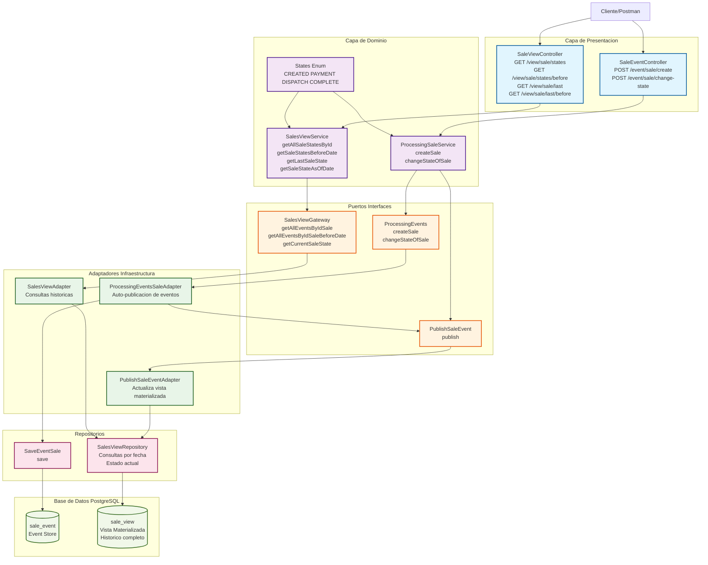
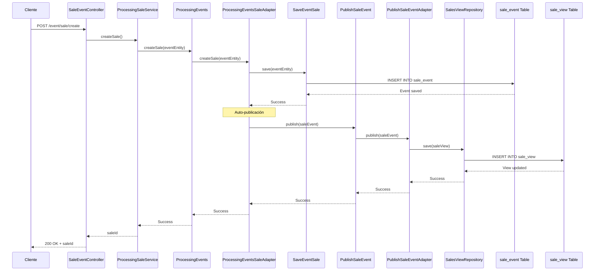
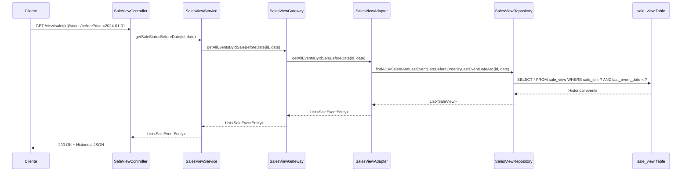
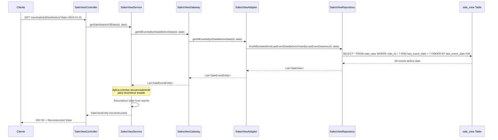
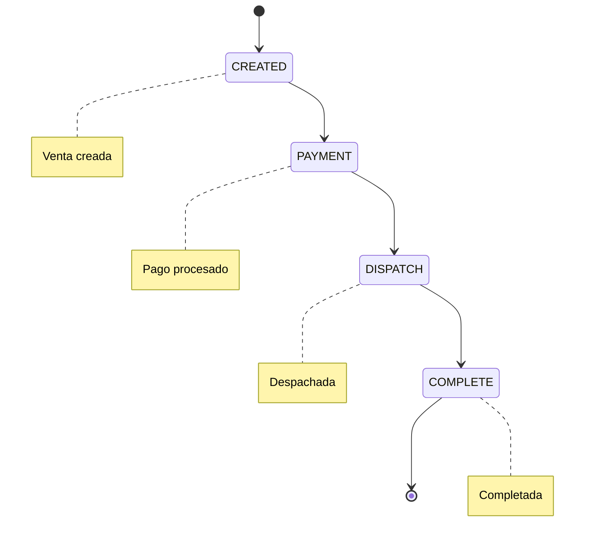

# Diagrama de Arquitectura - Event Sourcing POC (Actualizado)

## Descripción del Proyecto
Este proyecto implementa un ejemplo del patrón **Event Sourcing** para el manejo de ventas, donde los eventos se almacenan como fuente de verdad y se mantienen vistas materializadas para consultas rápidas. **Versión actualizada** con funcionalidades de reconstrucción de estado histórico.

## Diagrama de Arquitectura

## Flujo de Event Sourcing Actualizado

### 1. Comando (Write Operations) - Con Auto-publicación

### 2. Consulta Histórica (Read Operations) - Nueva Funcionalidad

### 3. Reconstrucción de Estado (Event Sourcing Core)

## Estados de la Venta

## Tecnologías Utilizadas

- **Framework**: Spring Boot 3.5.6
- **Lenguaje**: Java 21
- **Base de Datos**: PostgreSQL 17.2
- **ORM**: Spring Data JPA + Hibernate
- **Build Tool**: Gradle
- **Contenedorización**: Docker Compose
- **Logging**: Log4j2

## Nuevas Funcionalidades Implementadas

### 1. **Consultas Históricas**
- `GET /view/sale/{id}/states` - Todos los estados de una venta
- `GET /view/sale/{id}/states/before?date=...` - Estados antes de una fecha
- `GET /view/sale/{id}/last` - Último estado de una venta
- `GET /view/sale/{id}/last/before?date=...` - Estado reconstruido hasta una fecha

### 2. **Auto-publicación de Eventos**
- Los eventos se publican automáticamente al guardarse
- Actualización inmediata de la vista materializada
- Sincronización garantizada entre event store y vista

### 3. **Reconstrucción de Estado**
- Implementación del patrón Event Sourcing puro
- Aplicación secuencial de eventos para reconstruir estado
- Capacidad de "viajar en el tiempo" del estado de las ventas

## Patrones Arquitectónicos Implementados

1. **Event Sourcing**: Los eventos se almacenan como fuente de verdad
2. **CQRS**: Separación entre comandos (eventos) y consultas (vistas)
3. **Hexagonal Architecture**: Separación clara entre dominio e infraestructura
4. **Repository Pattern**: Abstracción del acceso a datos
5. **Gateway Pattern**: Interfaces para la comunicación entre capas
6. **Materialized Views**: Vistas optimizadas para consultas históricas
7. **State Reconstruction**: Reconstrucción de estado a partir de eventos

